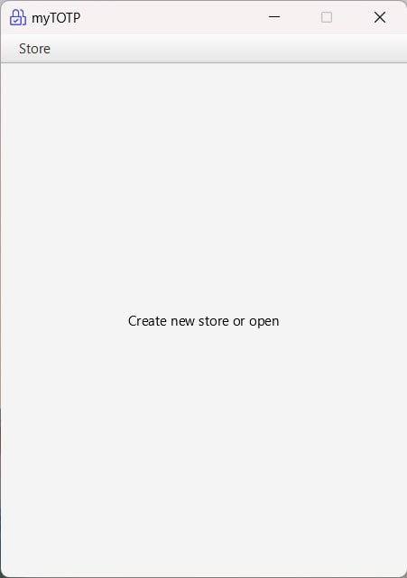
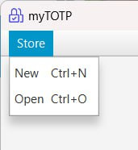
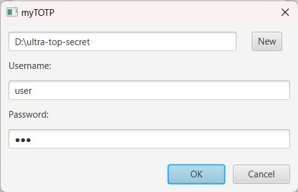
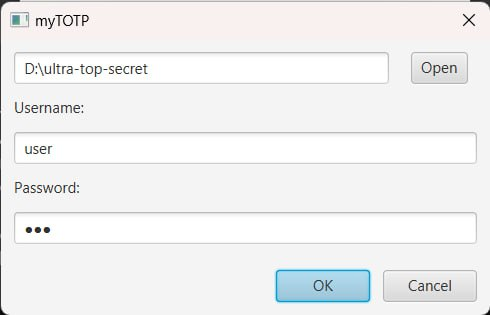
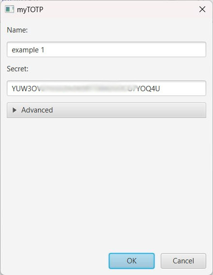
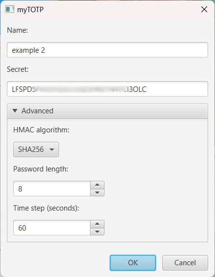
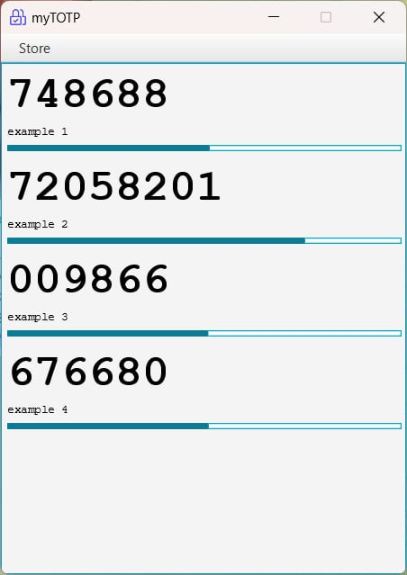
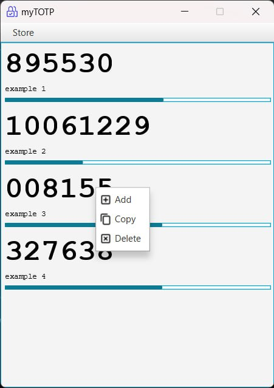
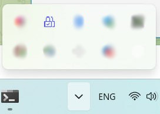

# myTOTP
GUI manager for TOTP  codes

## Features:
- [x] basic TOTP code secret management (add, copy, delete)
- [x] multiple accounts (saved on files, protected with username & password)
- [x] tray icon (don't have to open store file until powering of computer)
- [x] wide range HMAC algorithms (MD5, SHA1, SHA256, SHA384, SHA512)
- [x] different code lengths (6 - 10)
- [x] different time periods (30 seconds - 10 minutes)
- [x] adding codes from QR code/otpauth url
- [x] exporting/importing as plain text of otpauth url(s) 

## Requirement(s):
- Java 17 or higher

## Run:

```shell
java -jar mytotp-x.y.z.jar
```

## Defaults:
* HMAC algorithm: SHA1;
* code length: 6;
* time step: 30 seconds

## Some screenshots:

First opening app:



Main menu:



Creating/Opening store:




Adding new code:



Adding new code with advanced options:



Codes list:



Context menu:



Tray icon:




## Notes:
Tested using Google Authenticator and Password store

Any help is appreciated, feel free to contribute